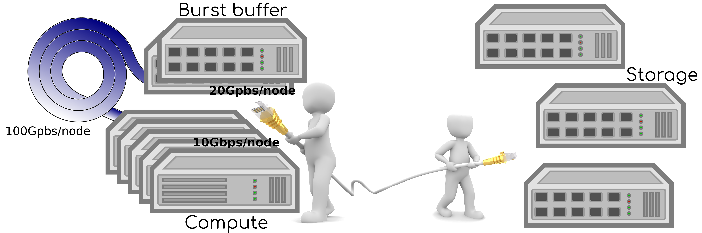

# Sophia cluster systems

The Sophia HPC cluster consists of

- login- and compute nodes
- burst buffer nodes for temporary data

each node with
[fast interconnect fabric](https://www.mellanox.com/page/products_dyn?product_family=192&mtag=sb7700_sb7790).

Embedded in the racks, alongside Sophia compute- and burst buffer nodes,
is a

- storage cluster for permanent data

hosting the `$HOME` directory for Sophia users as well as shared directory
infrastructure to facilitate collaboration on projects. The storage cluster
is connected to compute nodes and burst buffer with
[high-end commodity interconnect fabric](https://i.dell.com/sites/doccontent/shared-content/data-sheets/en/Documents/Dell-EMC-Networking-S4048-ON-Spec-Sheet.pdf).
